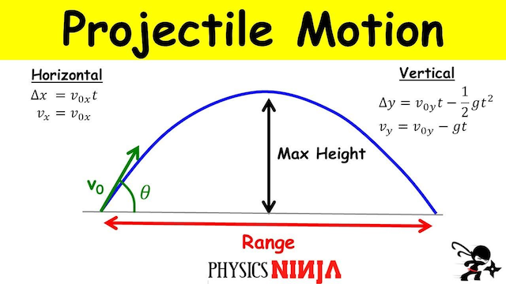
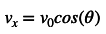
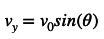
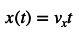
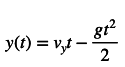
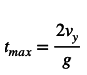
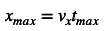
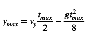

Design due: **Thursday, Aug 31st** at the beginning of class

Program due: **Tuesday, Sept 5th by 11:59 PM**

Getting Started
===============

Start by downloading [CS101\_Assign01.zip](CS101_Assign01.zip), saving it in the directory **H:\\CS101**.

Start a **Cygwin Terminal** and run the following commands:

    cd h:
    cd CS101
    unzip CS101_Assign01.zip
    cd CS101_Assign01

Using **Notepad++**, open the file

> **H:\\CS101\\CS101\_Assign01\\Projectile.cpp**

Your Tasks
==========

## Design

Based on the requirements described below in the "Program" section, fill out a [design template](../design-template.pdf).  Consider what the input and output of the program are, and what steps are necessary to compute the output from the input.

The design is due at the beginning of class on **Thursday, August 31st**.

## Program

Your task is to write a program that prompts the user to enter the launch angle (in degrees) and initial velocity (in m/s) of an object. The program should then print out the object's total time in the air, the maximum height the object reached, and the horizontal distance the object covered.

Here is an example run of the program (user input in **bold**):

<pre>
Enter the launch angle in degrees: <b>50</b>
Enter the initial velocity in mph: <b>25.6</b>
The object took 3.19 seconds to hit the ground.
The object travelled xxx feet or yyy meters.
The object reached a height of xxx feet or yyy meters.
</pre>

The time field should have two decimal places of precision. All of the distance values should allow for up to four digits *in front* of the decimal point and one digit *after* the decimal point such that the decimal points are aligned in the final output.

When you are ready to compile the program, in the Cygwin bash shell (or Linux terminal) window type the command

    make

To run the program, type the command

    ./Projectile.exe

Hints
=====

Physics
-------

The basic physics governing the trajectory of a projectile object (neglecting air resistance) is based on integrating the initial conditions using the acceleration due to gravity (which for the earth is 9.81 m/s2) with respect to time. 

> 

[https://i.ytimg.com/vi/Mp8bz5P1m4I/maxresdefault.jpg](https://i.ytimg.com/vi/Mp8bz5P1m4I/maxresdefault.jpg)

Where the initial velocity is *v*0 and initial angle Θ. Thus we can compute the horizontal and vertical components of the initial velocity as

> 

> 

The position of the object as a function of time **t** is found by integrating the velocity with respect to time (where *g = 9.81* m/sec is the acceleration of gravity) as follows

> 

> 

where *x(t)* and *y(t)* are the positions at time *t* (assuming the object started at *x(0) = 0* and *y(0) = 0*).

Therefore we can find the *time* it takes the object to hit the ground by setting *y(t) = 0* and solving for *t*max giving

> 

Once the time is computed, we can find the maximum distance, i.e. *range*, by substituting *t*max into *x(t)* as

> 

Similarly we can find the maximum height by substituting *t*max/2 (which is when the maximum height will occur) into *y(t)* as

> 

**NOTE:** It is important that all the units match. Thus some useful conversions

> -   3.28 feet/meter
> -   3600 seconds/hour
> -   1609 meters/mile

**USE** the computer to compute the conversion factors by simply writing expressions in your program and storing the results in variables.

Programming
-----------

**START EARLY! And develop the program incrementally!** You should always have a working program at each step (even if only minimally) to make it easier to debug errors. For example, make sure the program obtains the user input properly and then add one computation at a time. Also make sure you follow good programming practices such as **adding comments**, **using meaningful variable names**, and **having proper indentation in the program**.

See pages 346&ndash;353 of the textbook for details regarding the conversion specifiers for **printf**.

Grading
=======

Your grade will be determined as follows:

* Design artifact: 15
* Proper variable datatypes: 5
* Input initial height: 25
* Determine time: 15
* Determine velocity m/s: 10
* Determine velocity ft/s: 10
* Determine velocity mph: 10
* Proper output format: 10

Submitting
==========

Your design will be collected in class on the day that designs are due.

To submit your program, make sure your **Freefall.cpp** file is saved, and in the Cygwin window type the command

    make submit

Enter your Marmoset username and password (which you should have received by email.) Note that your password will not be echoed to the screen. Make sure that after you enter your username and password, you see a message indicating that the submission was successful.

If the **make submit** command does not work, you can [submit using the web interface](../submitting.html) (see the link for details).

Make sure that you check the file(s) you submitted to ensure that they are correct.  See the instructions for [Verifying your submission](../submitting.html#verifying-your-submission).

<b>Important</b>: It is your responsibility to verify that you submitted the correct files.  You may receive a grade of 0 for incorrectly submitted work.

<!-- vim:set wrap: -->
<!-- vim:set linebreak: -->
<!-- vim:set nolist: -->
